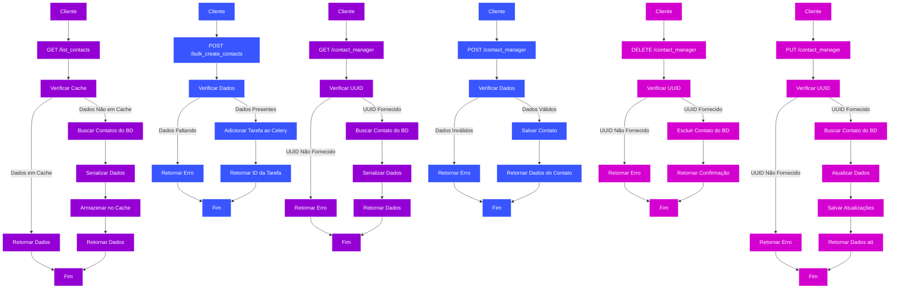

# Diagrama de Fluxo - Rotas

### Legenda de Cores

| Cor        | Métodos    |
|------------|-----------|
|  | POST  |
|  | GET |
|  | DELETE, PUT |

```mermaid
flowchart TD
    %% Estilos globais para o diagrama
    classDef azul fill:#3955FF,stroke:#ffffff,color:#ffffff;
    classDef rosa fill:#D400CF,stroke:#ffffff,color:#ffffff;
    classDef roxo fill:#9400D4,stroke:#ffffff,color:#ffffff;

    A1[Cliente] --> B1[GET /list_contacts]
    B1 --> C1[Verificar Cache]
    C1 -->|Dados em Cache| D1[Retornar Dados]
    D1 --> E1[Fim]
    C1 -->|Dados Não em Cache| F1[Buscar Contatos do BD]
    F1 --> G1[Serializar Dados]
    G1 --> H1[Armazenar no Cache]
    H1 --> I1[Retornar Dados]
    I1 --> E1[Fim]

    A2[Cliente] --> B2[POST /bulk_create_contacts]
    B2 --> C2[Verificar Dados]
    C2 -->|Dados Faltando| D2[Retornar Erro]
    D2 --> E2[Fim]
    C2 -->|Dados Presentes| F2[Adicionar Tarefa ao Celery]
    F2 --> G2[Retornar ID da Tarefa]
    G2 --> E2[Fim]

    A3[Cliente] --> B3[GET /contact_manager]
    B3 --> C3[Verificar UUID]
    C3 -->|UUID Não Fornecido| D3[Retornar Erro]
    D3 --> E3[Fim]
    C3 -->|UUID Fornecido| F3[Buscar Contato do BD]
    F3 --> G3[Serializar Dados]
    G3 --> H3[Retornar Dados]
    H3 --> E3[Fim]

    A4[Cliente] --> B4[POST /contact_manager]
    B4 --> C4[Verificar Dados]
    C4 -->|Dados Inválidos| D4[Retornar Erro]
    D4 --> E4[Fim]
    C4 -->|Dados Válidos| F4[Salvar Contato]
    F4 --> G4[Retornar Dados do Contato]
    G4 --> E4[Fim]

    A5[Cliente] --> B5[PUT /contact_manager]
    B5 --> C5[Verificar UUID]
    C5 -->|UUID Não Fornecido| D5[Retornar Erro]
    D5 --> E5[Fim]
    C5 -->|UUID Fornecido| F5[Buscar Contato do BD]
    F5 --> G5[Atualizar Dados]
    G5 --> H5[Salvar Atualizações]
    H5 --> I5[Retornar Dados att]
    I5 --> E5[Fim]

    A6[Cliente] --> B6[DELETE /contact_manager]
    B6 --> C6[Verificar UUID]
    C6 -->|UUID Não Fornecido| D6[Retornar Erro]
    D6 --> E6[Fim]
    C6 -->|UUID Fornecido| F6[Excluir Contato do BD]
    F6 --> G6[Retornar Confirmação]
    G6 --> E6[Fim]

    %% Aplicando classes de cores de acordo com o tipo de requisição
    class A1,B1,C1,D1,E1,F1,G1,H1,I1 roxo; 
    class A2,B2,C2,D2,E2,F2,G2 azul;
    class A3,B3,C3,D3,E3,F3,G3,H3 roxo; 
    class A4,B4,C4,D4,E4,F4,G4 azul; 
    class A5,B5,C5,D5,E5,F5,G5,H5,I5 rosa;
    class A6,B6,C6,D6,E6,F6,G6 rosa;
```

